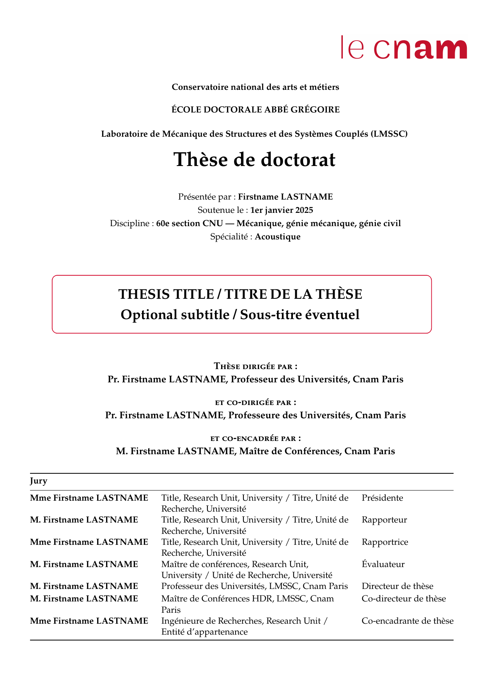

---
# Uncomment to override _quarto.yml values at document level /
# Décommenter pour surcharger les valeurs de _quarto.yml au niveau du document
# title: "Custom title / Mon titre personnalisé"
# author: "Firstname LASTNAME"
---

<!-- =================================================================
  THESIS MASTER FILE — contains no written content
  FICHIER MAÎTRE DE LA THÈSE — ne contient pas de texte rédigé
  =================================================================

  French render / Rendu français :  quarto render --profile fr
  English render / Rendu anglais :  quarto render --profile en

  FILES TO EDIT (French thesis) / FICHIERS À ÉDITER (thèse en français) :
    _quarto.yml                                      → title, author, jury, discipline…
    content_fr/liminaire/remerciements.qmd           → acknowledgements / remerciements
    content_fr/liminaire/resume.qmd                  → French abstract + keywords / résumé + mots-clés
    content_fr/liminaire/abstract.qmd                → English abstract + keywords
    content_fr/chapitres/01-chapitre1.qmd            → first chapter (duplicate to add more) / premier chapitre
    content_fr/postliminaire/conclusion.qmd          → conclusion
    content_fr/postliminaire/annexes.qmd             → appendices / annexes
    references/references.bib                        → BibTeX bibliography / bibliographie BibTeX

  FILES TO EDIT (English thesis) / FICHIERS À ÉDITER (thèse en anglais) :
    _quarto.yml                                      → title, author, jury, discipline…
    content_en/frontmatter/acknowledgements.qmd      → acknowledgements
    content_en/frontmatter/resume.qmd                → French abstract (Cnam requirement) / résumé français (exigence Cnam)
    content_en/frontmatter/abstract.qmd              → English abstract + keywords
    content_en/chapters/01-chapter1.qmd              → first chapter (duplicate to add more)
    content_en/backmatter/conclusion.qmd             → conclusion
    content_en/backmatter/appendices.qmd             → appendices
    references/references.bib                        → BibTeX bibliography / bibliographie BibTeX
  ================================================================= -->

<!-- HTML cover page — only visible in HTML output.
     PDF cover is generated by _extensions/cnam-thesis/partials/before-body.tex
     Page de couverture HTML — visible uniquement en HTML.
     La couverture PDF est générée par before-body.tex -->
:::: {.content-visible when-format="html"}

# Accueil {.unnumbered .unlisted .no-latex}



::: {.content-visible when-profile="fr"}
::: {.thesis-header-banner}
Thèse de doctorat — Conservatoire national des arts et métiers
:::
:::

::: {.content-visible when-profile="en"}
::: {.thesis-header-banner}
PhD Thesis — Conservatoire national des arts et métiers
:::
:::

<!-- Two-column layout: book cover left, metadata right (stacked on mobile).
     Mise en page deux colonnes : couverture à gauche, métadonnées à droite (empilé sur mobile). -->

<!-- Book cover — clicking downloads the PDF. linkCoverToPdf() in header-setup.html
     wraps .thesis-book-container with <a class="thesis-book-link"> at runtime so
     Pandoc never sees an <a> wrapping block elements (which causes duplicate nodes).
     La couverture est cliquable. Le <a> wrapper est créé au runtime par JS pour
     éviter que Pandoc ne génère un nœud vide en parsant un <a> autour de 
. -->

::: {.content-visible when-profile="fr"}
::: {.thesis-meta}
**Soutenue le :** 

**Discipline :** 

**Spécialité :** 

**École doctorale :** 

**Laboratoire :** 

**Directeur·trice de thèse :** 
:::

[Commencer la lecture](content_fr/liminaire/resume.html){.btn-start-reading}
:::

::: {.content-visible when-profile="en"}
::: {.thesis-meta}
**Defended on:** 

**Field:** 

**Speciality:** 

**Doctoral school:** 

**Laboratory:** 

**Thesis supervisor:** 
:::

[Start reading](content_en/frontmatter/resume.html){.btn-start-reading}
:::

::::
